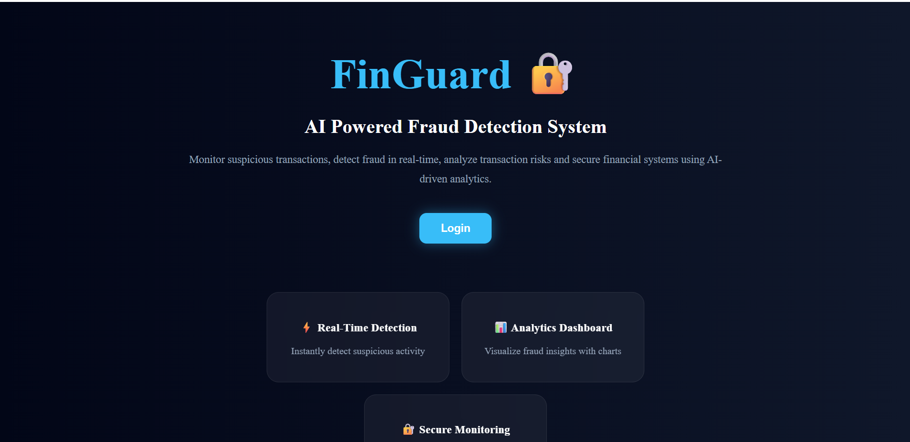
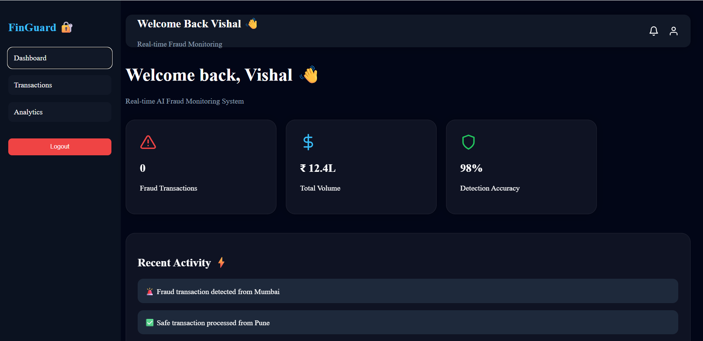
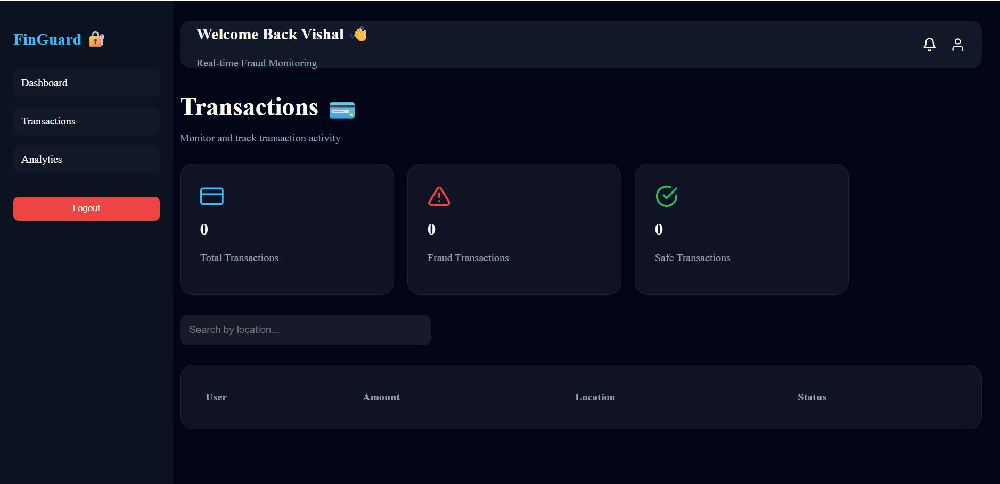
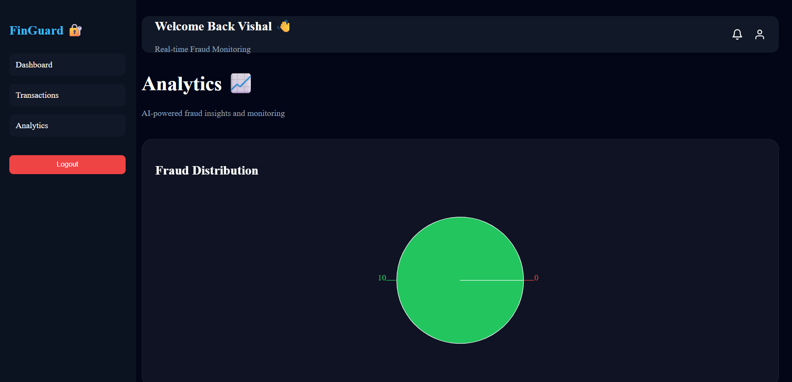

# 🔐 FinGuard AI

AI-powered fraud detection and fintech monitoring platform built using React, Node.js, MongoDB, JWT Authentication, Docker, and Analytics Dashboard.

---

# 🚀 Features

✅ Secure JWT Authentication  
✅ Protected Routes  
✅ Real-Time Fraud Monitoring  
✅ Fraud Detection Logic  
✅ Analytics Dashboard  
✅ Transaction Monitoring  
✅ Responsive Fintech UI  
✅ MongoDB Database Integration  
✅ REST API Backend  
✅ Dockerized Backend Support  

---

# 🖥️ Tech Stack

## Frontend
- React.js
- React Router DOM
- Axios
- Recharts
- React Icons

## Backend
- Node.js
- Express.js
- JWT Authentication
- MongoDB
- Mongoose

## DevOps / Tools
- Docker
- GitHub
- MongoDB Atlas

---

# 📊 Dashboard Modules

## 🔹 Home Page
Modern landing page with fintech SaaS design.

## 🔹 Login System
JWT-based secure login authentication.

## 🔹 Dashboard
- Fraud statistics
- Analytics charts
- Recent activity
- AI monitoring insights

## 🔹 Transactions Page
- Real-time transaction table
- Fraud transaction tracking
- Search and filtering

## 🔹 Analytics Page
- Fraud distribution charts
- AI insights
- Monitoring dashboard

---

# ⚙️ Installation

## 1️⃣ Clone Repository

```bash
git clone YOUR_GITHUB_REPO_LINK
```

---

## 2️⃣ Backend Setup

```bash
cd Finguard
npm install
```

Create `.env`

```env
PORT=5000
JWT_SECRET=secretkey
MONGO_URI=YOUR_MONGODB_URI
```

Run backend:

```bash
npm start
```

---

## 3️⃣ Frontend Setup

```bash
cd frontend
npm install
npm run dev
```

---

# 🐳 Docker Setup

Run backend container:

```bash
docker compose up
```

---

# 🔐 Test Login Credentials

```text
Email: vishal@test.com
Password: 123456
```

---

# 📈 API Endpoints

## Authentication

```text
POST /api/auth/login
```

## Transactions

```text
POST /api/transactions/add
GET /api/transactions
```

## Analytics

```text
GET /api/analytics/fraud-count
```

---

## 🏠 Home Page


---

## 🔐 Login Page



---

## 📊 Dashboard



---

## 💳 Transactions Page



---

## 📈 Analytics Page



---

# 🚀 Future Enhancements

- AI/ML Fraud Detection
- AWS Deployment
- CI/CD Pipeline
- Real-Time Notifications
- WebSocket Live Monitoring
- Admin Role Management

---

# 👨‍💻 Developer

## Vishal Kawade

Aspiring Full Stack & AWS DevOps Engineer.

---

# ⭐ Project Highlights

This project demonstrates:
- Full Stack Development
- REST API Integration
- Authentication Systems
- MongoDB Database Management
- Frontend UI Design
- Docker Usage
- Analytics Dashboard Development
